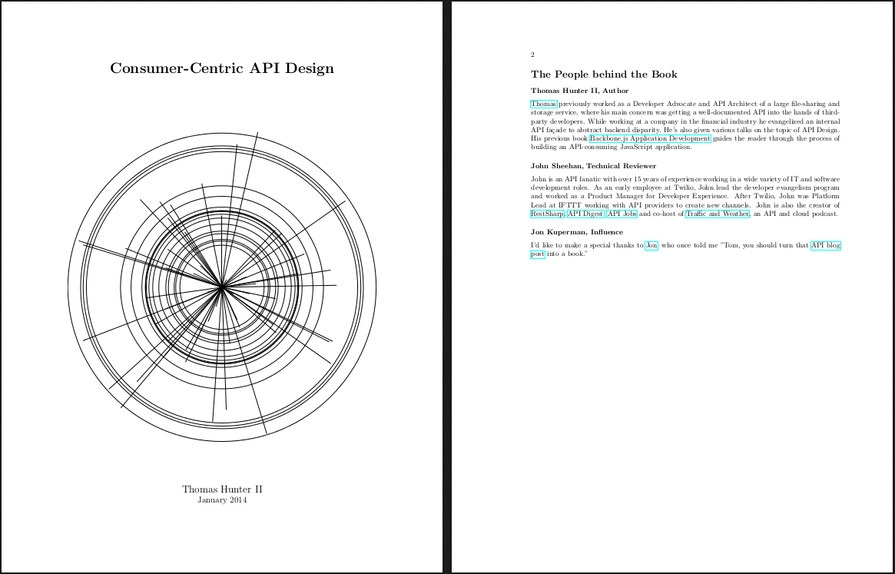

# Consumer-Centric API Design

This is a book I started writing in early 2014 (January 1st, according to the commit history).
My goal is to eventually get it published (either self-published or through a publisher) and sell copies.
One might think making content freely available while also planning on selling it would be disasterous,
but hey, if it works for Trent Reznor surely it can work for me.



Currently the book weighs in at about 55 pages. I like to think of it as covering content in a concise
manner, but I'm sure it really just needs more content ;). I'd like to hit at least 100 pages, though
that's not to say content needs to be watered down to fill more space.

## Downloading PDFs

[Download Book Builds Here](https://thomashunter.name/consumer-centric-api-design/)

## Table of Contents

```
1 The Basics
  1 Data Design and Abstraction
    1 Examples of Abstraction
    2 Real World Examples
  2 Anatomy of an HTTP Message
    1 HTTP Request
    2 HTTP Response
    3 Debugging HTTP Traffic
  3 API Entrypoint
    1 Choosing an Entrypoint
    2 Content Located at the Root

2 API Requests
  1 HTTP Methods
  2 URL Endpoints
    1 Top-Level Collections
    2 Specific Endpoints
  3 Filtering Resources
  4 White-Listing Attributes
    1 Filtered Request
    2 Unfiltered Request
  5 Body Formats
    1 JSON
    2 Form URL Encoded
    3 Multi-Part Form Data

3 API Responses
  1 HTTP Status Codes
    1 Common API Status Codes
    2 Status Code Ranges
  2 Content Types
  3 Expected Body Content
  4 JSON Attribute Conventions
    1 Consistency between Resources
    2 Booleans
    3 Timestamps
    4 Resource Identifiers (IDs)
    5 Nulls
    6 Arrays
    7 Whitespace
  5 Error Reporting
    1 Validation Errors
    2 Generic Errors
    3 Always Handle Server Errors
    4 String-Based Error Codes
  6 Responses should Resemble Requests
    1 Acceptable Discrepancy
    2 Avoidable Discrepancy

4 The API Ecosystem
  1 API Versioning
    1 Requesting a Specific Version
  2 Authentication and Authorization
    1 Two-Legged Authentication (2LA)
    2 Three-Legged Authentication (3LA)
    3 Real-World Usage
  3 Consumer Permissions
    1 Per-Authorization Permissions
    2 Default Consumer Permissions
  4 Rate Limiting
  5 API Analytics
  6 Documentation
  7 Convenience of Developer Testing
    1 Web-Based Developer Console
    2 Providing cURL Commands

5 Beyond REST
  1 Hypermedia APIs: REST Evolved
    1 ATOM: An Early Hypermedia API
  2 Response Document Standards
    1 JSON Schema
    2 JSON API
    3 Siren
  3 Alternatives to REST
    1 JSON RPC
    2 SOAP
```

## Contributing

If you'd like to see more topics covered in this book, submit an issue with your question and I'll either
research and write up some content, ask for clarification, or possibly close the issue if it feels too
outside the scope of the book.

If you'd like to write content for the book, submit a pull request and I'll check it out (contact me
beforehand just to make sure the topic you write about is something that'll fit into the scope of the
book). When this happens, I'll come up with some sort of system for keeping track of contributors, and
probably have a dedicated page in the book itself. Content submitted in this manner will be given the
once over by yours-truly to ensure consistency in writing style.

Of course, any contributions made to this book will give me (and whatever publisher I go with)
non-exclusive rights to do whatever we want with it. Sorry, legal stuff.

## Installing LaTeX

Installing LaTeX will allow you to build the book yourself if you plan on contributing. However, it is
not necessary that you have LaTeX installed nor that your content properly adheres to the spec. If you
don't want to go through the effort to learn it, simply toss some content where you think it should go,
submit a pull request, and I'll look it over and make the necessary modifications.

### OS X

There's a convenient package you can install called [MacTeX](https://tug.org/mactex/).

There's also a homebrew cask you can tap, but in the background it grabs that same package.

### Debian/Ubuntu Linux

If you're using a Debian-based linux distribution (e.g. Ubuntu), install the package `texlive`:

```
sudo apt-get install texlive
```

Other distributions may have different package names.

### Windows

On windows, you can install the [MiKTeX](http://miktex.org/) project (although you won't be able to run
`build.sh` to compiile the book, you'll need to run the relevant commands manually).

## Building the Book

Once you have LaTeX run the following command from within the book directory:

```
./build.sh
```

The book will be named something like `Consumer-Centric API Design vX.Y.Z.pdf`.

## Donations

Donations help fund the time I've spent on the project (as well as validate I should keep going).

* [GitTip/tlhunter](https://www.gittip.com/tlhunter/)
* Bitcoin: `16XGDMMDFFWrL2qsbTUjyK97zK6uiM5fYC`

## License


[Attribution-NonCommercial-NoDerivatives 4.0 International](http://creativecommons.org/licenses/by-nc-nd/4.0/)

### You are free to:

**Share** — copy and redistribute the material in any medium or format

The licensor cannot revoke these freedoms as long as you follow the license terms.

### Under the following terms:

* **Attribution** — You must give appropriate credit, provide a link to the license, and indicate if changes were made. You may do so in any reasonable manner, but not in any way that suggests the licensor endorses you or your use.
* **NonCommercial** — You may not use the material for commercial purposes.
* **NoDerivatives** — If you remix, transform, or build upon the material, you may not distribute the modified material.

**No additional restrictions** — You may not apply legal terms or technological measures that legally restrict others from doing anything the license permits.

### Notices:

You do not have to comply with the license for elements of the material in the public domain or where your use is permitted by an applicable exception or limitation.

No warranties are given. The license may not give you all of the permissions necessary for your intended use. For example, other rights such as publicity, privacy, or moral rights may limit how you use the material.
