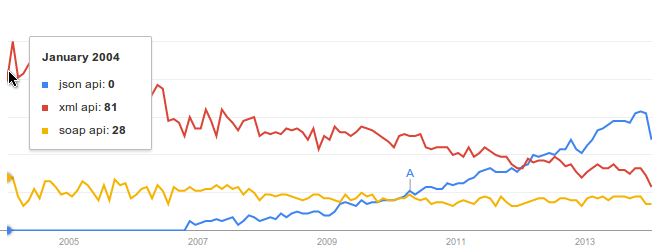
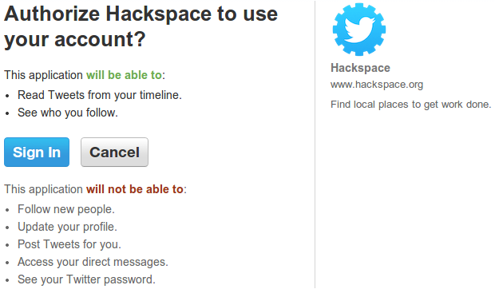
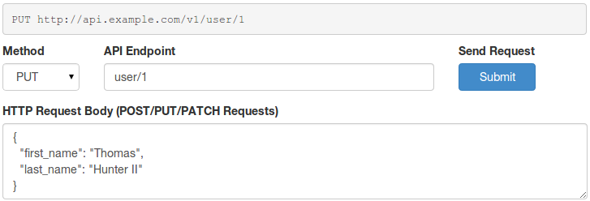

# Principles of good RESTful API Design

> An API represents a contract between your data and those who Consume your data. Breaking this contract will result in angry emails from developers and sad sad users with broken mobile apps. Designing a hard-to-use API will result in few or no Third-Party Consumers. On the other hand, building a great API and adhering to this contract will result in substantially more Third-Party Consumers and can elevate your service from a closed-source product to an open platform.

## Introduction

Building an API is one of the most important things you can do to increase the value of your service. By having an API, your service / core application has the potential to become a platform from which other services grow. Look at the current huge tech companies: Facebook, Twitter, Google, GitHub, Amazon, Netflix... None of them would be nearly as big as they are today if they hadn't opened up their data via API. In fact, an entire industry exists with the sole purpose of consuming data provided by said platforms.

> The easier your API is to consume, the more people that will consume it.

The principles of this document, if followed while designing and operating your API, will ensure that Consumers will grok your API while substantially reducing support tickets. Developers will travel from tech conference to tech conference telling everyone what a pleasure working with your API is and convincing them to sign up.

### Approach

This book will take a language-agnostic approach to showing you good API design. While there will be a few code examples here and there, you won't actually need to run any of them to understand what is going on. In fact, this book would make a good candidate for sitting on the back of your toilet.

Code examples will often be done in a couple different languages, e.g. PHP and Node.js.

A lot of this is philosophical, not so much technical.

### Intended Audience

Anyone who has built a few websites, knows how to serve up a webpage over HTTP in their platform of choice. Knowing how to read and write HTTP headers is also important. Knowing generic SQL syntax is useful as well, as some example queries are shown in many sections.

### Goals of this Book

By the time you're done reading this book you'll have a high-level understanding of how to build a great RESTful API Ecosystem. This book will not cover the technical details of how to write code an API from scratch.

## Data Design and Abstraction

Interacting with data using a REST API is all about boiling down all of the intricate business logic and data storage your service provides into the four basic CRUD concepts (Create, Read, Update, Delete). Your application may have all sorts of complex actions such as sending a text message or resizing an image or moving a file, but if you do enough planning and abstraction, everything can be represented as CRUD.

Planning how your API will look begins earlier than you'd think; first you need to decide how your data will be designed and how your core service / application will work. If you're doing [API First Development](http://blog.pop.co/post/67465239611/why-we-chose-api-first-development) this should be easy. If you're attaching an API to an existing project, you may need to provide more abstraction.

Occasionally, a Collection can represent a database table, and a Resource can represent a row within that table. However, this is not the usual case. In fact, your API should abstract away as much of your data and business logic as possible. It is very important that you don't overwhelm Third-Party Developers with any complex application data, if you do they won't want to use your API.

There are also many parts of your service which you SHOULD NOT expose via API at all. A common example is that many APIs will not allow third parties to create users.

Sometimes multiple tables should be represented as a single resource. Maybe even one table having multiple resources, if it makes sense (although, you may have made some poor database design decisions).

### An Example of Bad Abstraction

TODO

### An Example of Good Abstraction

TODO

## Raw HTTP Packet

Since everything we do is over HTTP, I'm going to show you a dissection of an HTTP packet. I'm often surprised at how many people don't know what these things look like! When the Consumer sends a Request to the Server, they provide a set of Key/Value pairs, called a Header, along with two newline characters, and finally the request body. This is all sent in the same packet.

The server then responds in the say Key/Value pair format, with two newlines and then the response body. HTTP is very much a request/response protocol; there is no "Push" support (the Server sending data to the Consumer unprovoked), unless you use a different protocol such as Websockets.

### Example HTTP Request

	POST /v1/animal HTTP/1.1
	Host: api.example.org
	Accept: application/json
	Content-Type: application/json
	Content-Length: 24

	{
	  "name": "Gir",
	  "animal_type": 12
	}

### Example HTTP Response

	HTTP/1.1 200 OK
	Date: Wed, 18 Dec 2013 06:08:22 GMT
	Content-Type: application/json
	Access-Control-Max-Age: 1728000
	Cache-Control: no-cache

	{
	  "id": 12,
	  "created": 1386363036,
	  "modified": 1386363036,
	  "name": "Gir",
	  "animal_type": 12
	}

### Debugging HTTP Traffic

When designing your API, you should be able to work with tools which allow you to look at raw HTTP packets. Consider using [Wireshark](https://www.wireshark.org), for example. Also, make sure you are using a framework / web server which allows you to read and change as many of these fields as possible.

Here's an example of a heavier HTTP request of a form submission on a website. Notice all of the data sent back and forth using HTTP headers.

## API Root URL

The root location of your API is important, believe it or not. When a developer (read as code archaeologist) inherits an old project using your API and needs to build new features, they may not know about your service at all. Perhaps all they know is a list of URLs which the Consumer calls out to. It's important that the root entry point into your API is as simple as possible, as a long complex URL will appear daunting and can turn developers away.

### Root URL Location

Here are two common URL Root Locations:

* `https://example.org/api/*`
* `https://api.example.com/*`

If your application is huge, or you anticipate it becoming huge, putting the API on its own subdomain (e.g. **api.**) is a good choice. This can allow for some more flexible scalability down the road. It can also be useful for preventing which cookie data can be shared between the content website and the API.

If you anticipate your API will never grow to be that large, or you want a much simpler application setup (e.g. you want to host the website AND API from the same framework), placing your API beneath a URL segment at the root of the domain (e.g. **/api/**) works as well.

> Also, notice the HTTPS prefix. As a good RESTful API, you MUST host your API behind HTTPS.

Don't use a different TLD (Top Level Domain) for hosting your API than you do for hosting your website. This may sound tempting, as your main domain could be **example.com**, and your API and developer documentation be entirely located on **example.io**. However, there is no logical relationship between these two domains and an adversary could have purchased **example.io** and is posing as a legitamate counterpart to **example.com**. Also, the "code archeologist" might only have knowledge of one domain and not the other. Finally, if you _do_ want to share some cookies between the two websites (e.g. an authenticated user on **example.com** can be automatically logged into the developer site) it cannot be done as easily with two separate TLDs than with a subdomain or subdirectory.

### Content at the Root

It's a good idea to have content at the root of your API. Hitting the root of GitHub's API returns a listing of endpoints, for example. Personally, I'm a fan of having the root URL give information which a lost developer would find useful, e.g., how to get to the developer documentation for the API.

Here's a truncated example of the content provided by the [GitHub API Root URL](https://api.github.com/). Notice how it's both easily readable by a human and easily parsable by a machine.

    {
      "current_user_url": "https://api.github.com/user",
      "authorizations_url": "https://api.github.com/authorizations",
      "code_search_url": "https://api.github.com/search/code?q={query}{&page,per_page,sort,order}",
      "emails_url": "https://api.github.com/user/emails",
      ...
    }

## API Versioning

No matter what you are building, no matter how much planning you do beforehand, your core application is going to change, your data relationships will change, attributes will invariably be added and removed from your Resources. This is just how software development works, and is especially true if your project is alive and used by many people (which is likely the case if you're building an API).

    https://api.example.org/v1/*

Remember than an API is a published contract between a Server and a Consumer. If you make changes to the Servers API and these changes break backwards compatibility, you will break things for your Consumer and they will resent you for it. Do it enough, and they will leave. To ensure your application evolves AND you keep your Consumers happy, you need to occasionally introduce new versions of the API while still allowing old versions to be accessible.

As a side note, if you are simply ADDING new features to your API, such as new attributes on a Resource (which are not required and the Resource will function without), or if you are ADDING new Endpoints, you do not need to increment your API version number since these changes do not break backwards compatibility. You will want to update your API Documentation (your Contract), of course.

Over time you can deprecate old versions of the API. To deprecate a feature doesn't mean to shut if off or diminish the quality of it, but to tell Consumers of your API that the older version will be removed on a specific date and that they should upgrade to a newer version.

    Accept: application/json+v1;

A good RESTful API will keep track of the version in the URL. The other most common solution is to put a version number in a request header, but after working with many different Third Party Developers, I can tell you that adding headers is no where near as easy as adding a URL Segment.

## HTTP Verbs

Surely you know about GET and POST requests. These are the two most commonly requests used when your browser visits different webpages. All browsers, such as IE6, have been able to make these two requests. TODO Wording

There are four and a half very important HTTP verbs that you need to know about. I say "and a half", because the PATCH verb is very similar to the PUT verb, and two two are often combined by many an API developer. Here are the verbs, and next to them are their associated database call (I'm assuming most people reading this know more about writing to a database than designing an API).

* **GET**
    * Retrieve a specific Resource from the Server
    * Retrieve a listing of Resources from the Server
    * Think of this as a SQL SELECT statement
* **POST**
    * Creates a new Resource on the Server
    * Think of this as a SQL INSERT statement
* **PUT**
    * Update a Resource on the Server
    * Provide the entire Resource
    * Think of the SQL UPDATE statement providing null values for some keys
* **PATCH**
    * Update a Resource on the Server
    * Provide only changed attributes
    * Like the SQL UPDATE statement providing only a few keys
* **DELETE**
    * Remove a Resource from the Server
    * Similar to the SQL DELETE statement

Here are two lesser known HTTP verbs. Feel free to use them in your API, but they aren't 100% necessary.

* **HEAD**
    * Retrieve meta data about a Resource
    * Such as a hash of the data or when it was last updated
* **OPTIONS**
    * Retrieve information about what the Consumer is allowed to do with the Resource

A good RESTful API will make use of the four and a half HTTP verbs for allowing third parties to interact with its data, and will never include actions / verbs as URL segments.

Typically, GET requests can be cached (and often are!) Browsers, for example, will cache GET requests (depending on cache headers), and will go as far as prompt the user if they attempt to POST for a second time. A HEAD request is basically a GET without the response body, and can be cached as well.

## URL Endpoints

An Endpoint is a URL within your API which points to a specific Resource or a Collection of Resources.

Honestly, it doesn't matter too much if the endpoints are singular or plural. What does matter is that you stay consistent. The examples in this book are plural.

If you were building a fictional API to represent several different Zoo's, each containing many Animals (with an animal belonging to exactly one Zoo), employees (who can work at multiple zoos) and keeping track of the species of each animal, you might have the following endpoints:

* `https://api.example.com/v1/**zoos**`
* `https://api.example.com/v1/**animals**`
* `https://api.example.com/v1/**animal_types**`
* `https://api.example.com/v1/**employees**`

Each piece of data separated by slashes is a URL Segment. Try to keep these as simple as possible.

When referring to what each endpoint can do, you'll want to list valid HTTP Verb and Endpoint combinations. For example, here's a semi-comprehensive list of actions one can perform with our fictional API. Notice that I've preceded each endpoint with the HTTP Verb, as this is the same notation used within an HTTP Request header.

* `GET /zoos`: List all Zoos (ID and Name, not too much detail)
* `POST /zoos`: Create a new Zoo
* `GET /zoos/ZID`: Retrieve an entire Zoo object
* `PUT /zoos/ZID`: Update a Zoo (entire object)
* `PATCH /zoos/ZID`: Update a Zoo (partial object)
* `DELETE /zoos/ZID`: Delete a Zoo
* `GET /zoos/ZID/animals`: Retrieve a listing of Animals (ID and Name).
* `GET /animals`: List all Animals (ID and Name).
* `POST /animals`: Create a new Animal
* `GET /animals/AID`: Retrieve an Animal object
* `PUT /animals/AID`: Update an Animal (entire object)
* `PATCH /animals/AID`: Update an Animal (partial object)
* `GET /animal_types`: Retrieve a listing (ID and Name) of all Animal Types
* `GET /animal_types/ATID`: Retrieve an entire Animal Type object
* `GET /employees`: Retrieve an entire list of Employees
* `GET /employees/EID`: Retreive a specific Employee
* `GET /zoos/ZID/employees`: Retrieve a listing of Employees (ID and Name) who work at this Zoo
* `POST /employees`: Create a new Employee
* `POST /zoos/ZID/employees`: Hire an Employee at a specific Zoo
* `DELETE /zoos/ZID/employees/EID`: Fire an Employee from a specific Zoo

In the above list, ZID means Zoo ID, AID means Animal ID, EID means Employee ID, and ATID means Animal Type ID. Having a key in your documentation for whatever convention you choose is a good idea.

I've left out the common API URL prefix in the above examples for brevity. While this can be fine during communications, in your actual API documentation, you should always display the full URL to each endpoint (e.g. GET http://api.example.com/v1/animal_type/ATID).

Notice how the relationships between data is displayed, specifically the many to many relationships between employees and zoos. By adding an additional URL segment, one can perform more specific interactions. Of course there is no HTTP verb for "FIRE"-ing an employee, but by performing a DELETE on an Employee located within a Zoo, we're able to achieve the same effect.

## Resource Filtering for GET Requests

When a Consumer makes a request for a Collection, it is important that you give them a list of every single object matching the requested criteria. This list could be massive. But, it is important that you don't perform any arbitrary limitations of the data. It is these arbitrary limits which make it hard for a third party developer to know what is going on. If they request a certain Collection, and iterate over the results, and they never see more than 100 items, it is now their job to figure out where this limit is imposed. Is their ORM buggy and limiting items to 100? Is the network chopping up large packets?

> Minimize arbitrary limits imposed on Third Party Developers.

You do want to offer the ability for a Consumer to specify some sort of filtering/limitation of the results. The most important reason for this, as far as the Consumer is concerned, is that the network payload is minimal and the Consumer gets their results back as soon as possible. Another reason for this is the Consumer may be lazy, and if the Server can do filtering and pagination for them, all the better. The not-so-important reason (from the Consumers perspective), yet a great benefit for the Server, is that the request will be less resource intensive.

Filtering is mostly useful for performing GETs on Collections of resources. Since these are GET requests, filtering information should be passed via the URL. Here are some examples of the types of filtering you could conceivably add to your API:

* `?limit=10&offset=20`: Pagination of results (`LIMIT 20, 10`)
* `?animal_type_id=1`: Filter records which match the following condition (`WHERE animal_type_id = 1`)
* `?sort_attribute=name,asc`: Sort the results based on the specified attribute (`ORDER BY name ASC`)

Some of these filterings can be redundant with endpoint URLS. In the Endpoints chapter we mentioned `GET /zoo/ZID/animals`. This would be the same thing as `GET /animals?zoo_id=ZID`. Dedicated endpoints being made available to the Consumer will make their lives easier, this is especially true with requests you anticipate they will make a lot. In the documentation, mention this redundancy so that Third Party Developers aren't left wondering if differences exist.

Also, this goes without saying, but whenever you perform filtering or sorting of data, make sure you white-list the columns for which the Consumer can filter and sort by. We don't want any database errors being sent to Consumers!

## Respone Attribute Filtering for GET Requests

Often times, when a Consumer is requesting a specific Resource or Collection of Resources, they do not care about all of the attributes belonging to the resource. Having so much data could be a network bottleneck. Responding with less data can also reduce the overhead on your server, for example it may prevent an unneccesary database `JOIN`.

Again, since we're dealing with GET requests, you'll want to accept a URL parameter for whitelisting parameters. In theory, blacklisting could work as well, but as new attributes appear in Resources over time (since additions are backwards compatible) the Consumer ends up receiving data it doesn't want.

The parameter name you choose isn't too important. It could be "filter" or "whitelist". In the examples below, I opted for an overly verbose option and called them "attribute_whitelist". Consistency between different Endpoints is what is most important.

### Example Unfiltered Single-Resource Request

In this example request, the default representation of a user object includes data from two tables joined together. One of the tables is the obvious user table, and another table contains some textual data related to a user called user_descriptions.

#### Request URL

    GET http://api.example.org/user/12

#### Resulting SQL Query

    SELECT * FROM user LEFT JOIN user_desc ON user.id = user_desc.id WHERE user.id = 12;

#### Response Body

    {
      "id": 12,
      "name": "Thomas Hunter II",
      "age": 27,
      "email": "me@thomashunter.name",
      "description": "Blah blah blah blah blah."
    }

### Example Filtered Single-Resource Request

In this next example, the consumer has requested a filtered list of attributes. So, we're returning less data. If you make use of an ORM, filtering of this data should be pretty simple, however if you're manually writing SQL queries, more effort may be involved.

#### Request URL

    GET http://api.example.org/user/12?attribute_whitelist=id,name,email

#### Resulting SQL Query

    SELECT id, name, email FROM user WHERE user.id = 12;

#### Response Body

    {
      "id": 12,
      "name": "Thomas Hunter II",
      "email": "me@thomashunter.name"
    }

## JSON Request Body for POST, PUT, and PATCH Requests

There are two common ways a Web Browser will send data to a Web Server. If you're using a common web language/framwork for building an API, such as PHP or Express.js or Ruby on Rails, you're already consuming data using these two methods. Web Servers (e.g. Apache or NGINX) abstract the differences of these two methods and will usually work with your programming language to provide data in one easy to consume format. The two methods are called Multipart Form Data (required for file uploads), as well as Form URL Encoded.

Below you'll see examples of both of those methods just so that you understand how the browser and server usually upload data. Unfortunately, neither of them are adaquate for sending complex data to a RESTful server. The third example is the method you should be accepting data as.

### Example Form URL Encoded Request

This method is used by Websites for accepting simple data forms from a web browser.

    POST /login HTTP/1.1
    Host: example.com
    Content-Length: 31
    Accept: text/html
    Content-Type: application/x-www-form-urlencoded
    
    username=root&password=Zion0101

### Example Multipart Form Data Request

This method is used by Websites for accepting more complex data from a web browser, such as file uploads.

    POST /file_upload HTTP/1.1
    Host: example.com
    Content-Length: 275
    Accept: text/html
    Content-Type: multipart/form-data; boundary=----RANDOM_jDMUxq4Ot5
    
    ------RANDOM_jDMUxq4Ot5
    Content-Disposition: form-data; name="file"; filename="hello.txt"
    Content-Type: application/octet-stream
    
    Hello World
    ------RANDOM_jDMUxq4Ot5
    Content-Disposition: form-data; name="some_checkbox"
    
    on
    ------RANDOM_jDMUxq4Ot5--

### Example JSON Request

This method is much better for uploading data. The JSON document used for the Request can be very similar to the JSON document used for the Response. JSON can specify the type of data (e.g. Integers, Strings, Booleans), while also allowing for hierarchal relationships of data.

	POST /v1/animal HTTP/1.1
	Host: api.example.org
	Accept: application/json
	Content-Type: application/json
	Content-Length: 24

	{
	  "name": "Gir",
	  "animal_type": 12
	}

## HTTP Response Status Codes

It is very important that as a RESTful API, you make use of the proper HTTP Status Codes; they are a standard after all! Various network equipment is able to read these status codes, e.g. load balancers can be configured to avoid sending requests to a web server sending out lots of 50x errors. Client libraries know if a request has succeeded or failed depending on the Status Code. There are a plethora of [HTTP Status Codes](http://www.w3.org/Protocols/rfc2616/rfc2616-sec10.html) to choose from, however this list should be a good starting point:

* `**200** OK`
    * GET Requests
    * The Consumer requested data from the Server, and the Server found it for them (Idempotent)
* `**201** ACCEPTED`
    * POST / PUT / PATCH Requests
    * The Consumer gave the Server data, and the Server accepted it
* `**202** NO CONTENT`
    * DELETE Requests
    * The Consumer asked the Server to delete a Resource, and the Server deleted it
* `**400** INVALID REQUEST`
    * POST / PUT / PATCH Requests
    * The Consumer gave bad data to the Server, and the Server did nothing with it (Idempotent)
* `**404** NOT FOUND`
    * All Requests
    * The Consumer referenced an inexistant Resource or Collection, and the Server did nothing (Idempotent)
* `**500** INTERNAL SERVER ERROR`
    * All Requests
    * The Server encountered an error, and the Consumer has no knowledge if the request was successful

### Status Code Ranges

The **1xx** range is reserved for low-level HTTP stuff, and you'll very likely go your entire career without manually sending one of these status codes.

The **2xx** range is reserved for successful messages where all goes as planned. Do your best to ensure your Server sends as many of these to the Consumer as possible.

The **3xx** range is reserved for traffic redirection. Most APIs do not use these requests much (not nearly as often as the SEO folks use them ;), however, the newer Hypermedia style APIs will make more use of these.

The **4xx** range is reserved for responding to errors made by the Consumer, e.g. they're providing bad data or asking for things which don't exist. These requests should be be idempotent, and not change the state of the server.

The **5xx** range is reserved as a response when the Server makes a mistake. Often times, these errors are thrown by low-level functions even outside of the developers hands, to ensure a Consumer gets some sort of response. The Consumer can't possibly know the state of the server when a 5xx response is received, and so these should be avoidable.

## Response Content Types

Currently, the most "exciting" of APIs provide JSON data from RESTful interfaces. This includes Facebook, Twitter, GitHub, you name it. XML appears to have lost the war a while ago (except in large corporate environments). SOAP, thankfully, is all but dead, and we really don't see much APIs providing HTML to be consumed (unless, that is, you're building a scraper!)

Here's a Google Trends graph comparing the terms JSON API, XML API, and SOAP API, which should give a good feel for how their popularity has changed over time:

Developers using popular languages and frameworks can very likely parse any valid data format you return to them. You can even provide data in any of the aforementioned data formats (not including SOAP) quite easily, if you're building a common response object and using a different serializer. What does matter though, is that you make use of the Accept header when responding with data.

Some API creators recommend adding a .json, .xml, or .html file extension to the URL (after the endpoint) for specifying the content type to be returned. With the different extensions added, we've now got different URLs for the same Resources. Use the Accept header, which is built into the HTTP spec for this purpose, and if you can't provide data in a format the Consumer wants, reply with a `406 Not Acceptable` response.

## Expected Response Bodies

When a Consumer makes a request to the Server, something needs to be returned in the response. Depending on the HTTP Verb being used, the response will be different. Here's a good list to adhere to:

* `GET /collection`
    * Return a listing (array) of Resource objects
* `GET /collection/resource_id`
    * Return a singular Resource object
* `POST /collection`
    * Return the newly created Resource object
* `PUT /collection/resource_id`
    * Return the complete Resource object
* `PATCH /collection/resource_id`
    * Return the complete Resource object
* `DELETE /collection/resource_id`
    * Return an empty document

Note that when a Consumer creates a Resource, they usually do not know the ID of the Resource being created (nor other attributes such as created and modified timestamps, if applicable). These additional attributes are returned with the resulting Response, which is vital for the Consumer to keep track of things.

## Response Document Standards

When responding with a document representing a Collection, it is usually adaquate to return a top-level array containing each Resource object. Likewise, when responding with a document representing a Resource, simply returning a top-level object containing the Resource is good-enough.

However, there are some standards people have developed for encapsulating these items in a standardized envelope to help give the Consumer some context when parsing the responses.

For example, if making a filtered request limiting the Collection to containing only 10 Resources, how do you let the Consumer know how many total records exist? If an error occurs, sure you reply with a 4XX or 5XX HTTP Status Code, but what about an object in the body representing an error? These different response document standards provide a standardized method for returning this meta data.

### JSON Schema ([json-schema.org](http://json-schema.org/))

TODO

### JSON API ([jsonapi.org](http://jsonapi.org/))

TODO

### Siren ([sirenspec.org](http://sirenspec.org))

TODO

## Authentication

There are two common paradigms your server may represent. In the three legged paradigm, a third-party API consumer is making requests on behalf of a user of your website / service. In a two-legged paradigm, there really isn't a user involved.

### Two Legged Authentication

TODO: Something proprietary? Simple GET parameter?

TODO: Research solutions

### Three Legged Authentication

TODO: Mention things need to be revoked.

Typically, a Server will want to know exactly who is making which Requests. Some APIs provide endpoints to be consumed by the general (anonymous) public, but most of the time work is being perform on behalf of someone.

[OAuth 2.0](https://tools.ietf.org/html/rfc6749) provides a great way of doing this. With each Request, you can be sure you know which Consumer is making requests, which User they are making requests on behalf of, and provides a (mostly) standardized way of expiring access or allowing Users to revoke access from a Consumer, all without the need for a third-party consumer to know the Users login credentials.

There are also [OAuth 1.0](http://tools.ietf.org/html/rfc5849) and [xAuth](https://dev.twitter.com/docs/oauth/xauth), which fill the same space. Whichever method you choose, make sure it is something common and well documented with many different libraries written for the languages/platforms which your Consumers will likely be using.

I can honestly tell you that OAuth 1.0a, while it is the most secure of the options, is a huge pain in the ass to implement. I was surprised by the number of Third Party Developers who had to implement their own library since one didn't exist for their language already. I've spent enough hours debugging cryptic "invalid signature" errors to recommend you choose an alternative.

## API Permissions

This is mostly applicable with Three Legged Authentication.

## API Analytics

Keep track of the version/endpoints of your API being used by Consumers. This can be as simple as incrementing an integer in a database each time a request is made. There are many reasons that keeping track of API Analytics is a good idea, for example, the most commonly used API calls should be made efficient.

For the purposes of building an API which Third Party Developers will love, the most important thing is that when you do deprecate a version of your API, you can actually contact developers using deprecated API features. This is the perfect way to remind them to upgrade before you kill the old API version.

The process of Third Party Developer notification can be automated, e.g. mail the developer every time 10,000 requests to a deprecated feature are made.

## Writing good Documentation

Honestly, if you don't conform 100% to the criteria in this guide, your API will not necessarily be horrible. However, if you don't properly document your API, nobody is going to know how to use it, and it WILL be a horrible API.

Make your Documentation available to unauthenticated developers.

Do not use automatic documentation generators, or if you do, at least make sure you're doctoring it up and making it presentable.

Do not truncate example request and response bodies; show the whole thing. Use a syntax highlighter in your documentation.

Document expected response codes and possible error messages for each endpoint, and what could have gone wrong to cause those error messages.

If you've got the spare time, build a developer API console so that developers can immediately experiment with your API. It's not as hard as you might think and developers (both internal and third party) will love you for it!

Make sure your documentation can be printed; CSS is a powerful thing; don't be afraid to hide that sidebar when the docs are printed. Even if nobody ever prints a physical copy, you'd be surprised at how many developers like to print to PDF for offline reading.

## Developer Console

Building a Developer Console will allow developers to quickly test API commands without having to run their applications over and over. If commands can be linked to from within the documentation, this is even better.

## Hypermedia APIs: REST Evolved

Hypermedia APIs are very likely the future of RESTful API design. They're actually a pretty amazing concept, going "back to the roots" of how HTTP and HTML was intended to work.

When working with non-Hypermedia RESTful APIs, the URL Endpoints are part of the contract between the Server and the Consumer. These Endpoints MUST be known by the Consumer ahead of time, and changing them means the Consumer is no longer able to communicate with the Server as intended. This, as you can assume, is quite a limitation.

Now, API Consumers are of course not the only user agent making HTTP requests on the Internet. Far from it. Humans, with their web browsers, are the most common user agent making HTTP requests. Humans, however, are NOT locked into this predefined Endpoint URL contract that RESTful APIs are. What makes humans so special? Well, they're able to read content, click links for headings which look interesting, and in general explore a website and interpret content to get to where they want to go. If a URL changes, a human is not affected (unless, that is, they bookmarked a page, in which case they go to the homepage and find a new route to their beloved data).

The Hypermedia API concept works the same way a human would. Requesting the Root of the API returns a listing of URLs which point perhaps to each collection of information, and describing each collection in a way which the Consumer can understand. Providing IDs for each resource isn't important (or necessarily required), as long as a URL is provided.

With the Consumer of a Hypermedia API crawling links and gathering information, URLs are always up-to-date within responses, and do not need to be known beforehand as part of a contract. If a URL is ever cached, and a subsequent request returns a 404, the Consumer can simply go back to the root and discover the content again.

When retrieving a list of Resources within a Collection, an attribute containing a complete URL for the individual Resources are returned. When performing a POST/PATCH/PUT, the response can be a 3xx redirect to the complete Resource.

JSON doesn't quite give us the semantics we need for specifying which attributes are URLs, nor how URLs relate to the current document. HTML, as you can probably guess, does provide this information. We may very well see our APIs coming full circle and returning back to consuming HTML. Considering how far we've come with CSS, one day we may even see  it be common practice for APIs and Websites to use the exact same URLs and content.

TODO: Link to some specs

Imagine a tool on the internet that you want to use. Could be Google Calendar, or Meetup, or Facebook Events. Now, imagine that you want to use other tools too, like email or instant messenger. Normally, integrations between tools are only convenient if you're dealing with a massive suite of tools, like you see offered by Microsoft or Google. TODO

Now, imagine that these amazing tools by different companies can all work with each other as tightly as these massive suite tools. The best of both worlds. Imagine it automatically working, them automatically discovering each other and configuring themselves to work together nicely. This is a future offered by hypermedia APIs. TODO

## JSON RPC: An Alternative to REST

Useful for situations without HTTP. Can be done over HTTP, sockets, etc. Useful for gaming, embedded systems.

If you've already got an HTTP server for your product, you probably want REST.

## XML SOAP: An Alternative to REST

This is a sort of example of Hypermedia API's gone wrong. Very complex. Also, nobody likes XML. Mention that I don't know much.

Big in corporate environments.

Mention how it Sucks

## About the Author and Reviewers

At the time of this writing, [Thomas Hunter II](http://thomashunter.name) works as a Developer Advocate / API Architect with Copy.com, where his number one concern is getting a well-documented API into the hands of Consumers. He also recently co-hosted a talk at the Ann Arbor PHP MySQL meetup on the topic of RESTful API Design.

Jonathon Kuperman TODO

Kelly King TODO
